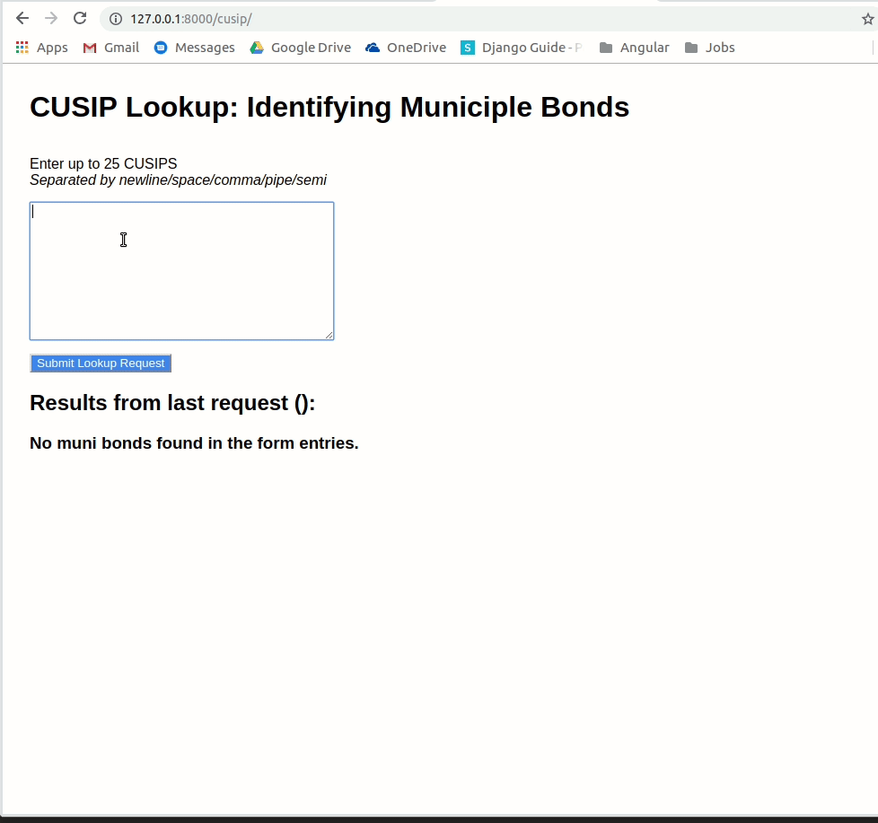
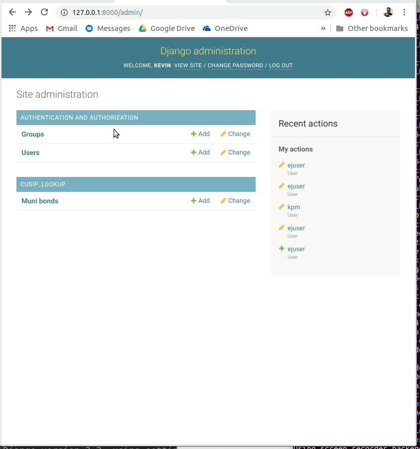

# Features

* Enter multiple ids for lookup
* API calls are made in batches of 5 in the backend (rate limited by OpenFIGI)
* Any `CUSIP`s that are identified as "Muni" are stored in the database along with the timestamp 
  of first fetch. Depending on use-case, we may want the first or the latest timestamp (for example,
  caching logic/Time-to-live in the local database)
* Muni is searched for in the `securityType2` field

# Demo

## User-interface



## Database




# Setup and Installation

This project was developed in a Linux environment with the following
recommended installations:

* git 2.17
* python 3.6
* virtualenv
* virtualenvwrapper

In your `projects` folder (or equivalent), clone the repo:  

```
git clone https://github.com/kpm1117/kmcdermott_ej
```

Use the following line to do three things at once: (a) create your virtual
environment named "kmcdermott_ej", (b) activate that environment, and (c) navigate
to the specified project folder. (Specification of a python executable is
recommended, though the path or exact version may differ.)

```
mkvirtualenv kmcdermott_ej -a <path/to/project/kmcdermott_ej> -p /usr/bin/python3.6
```

After confirming that your virtual environment is active and that you're in
the project folder, install dependencies:

```
pip install -r requirements.txt
```

Take care of any initial migrations. (You normally don't need to run
`makemigrations` as this should have been done before any model updates
were pushed. However, it doesn't hurt.)

```
python manage.py makemigrations
python manage.py migrate
```

Start your server:

```
python manage.py runserver
```

# Discussion

The OpenFIGI API documentation defines the following limits for
*non-authenticated* callers:

* 5 mapping jobs per request
* 25 mapping jobs per minute

